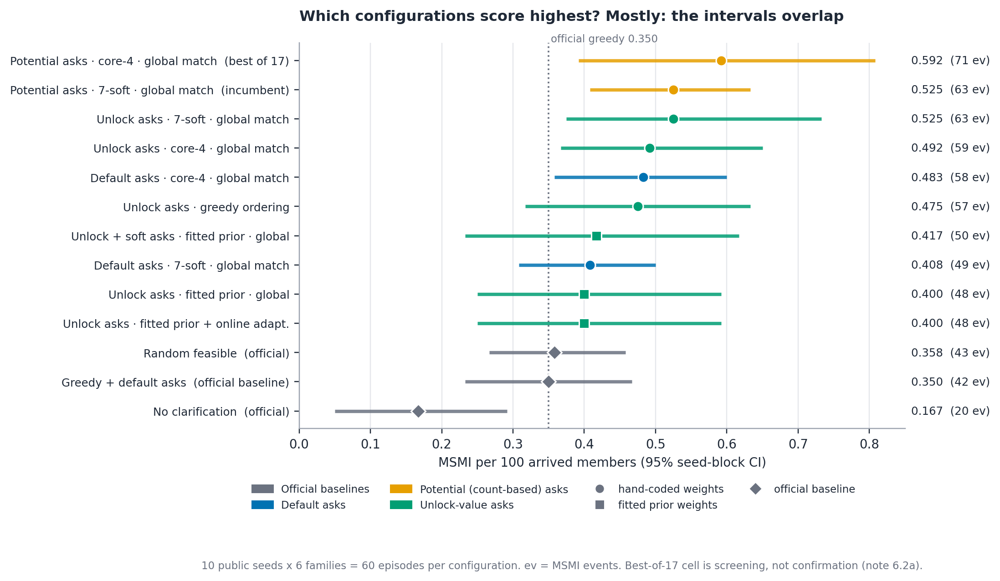
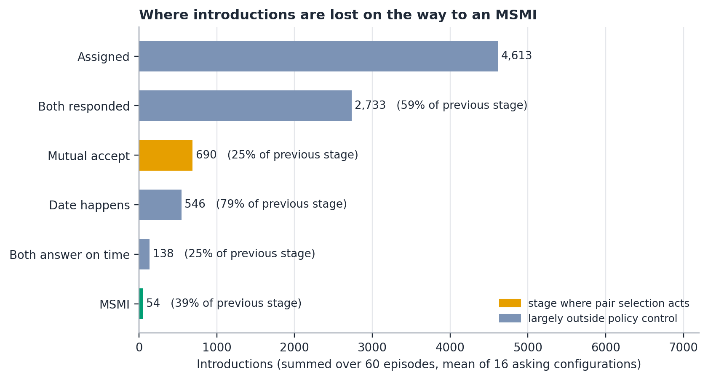
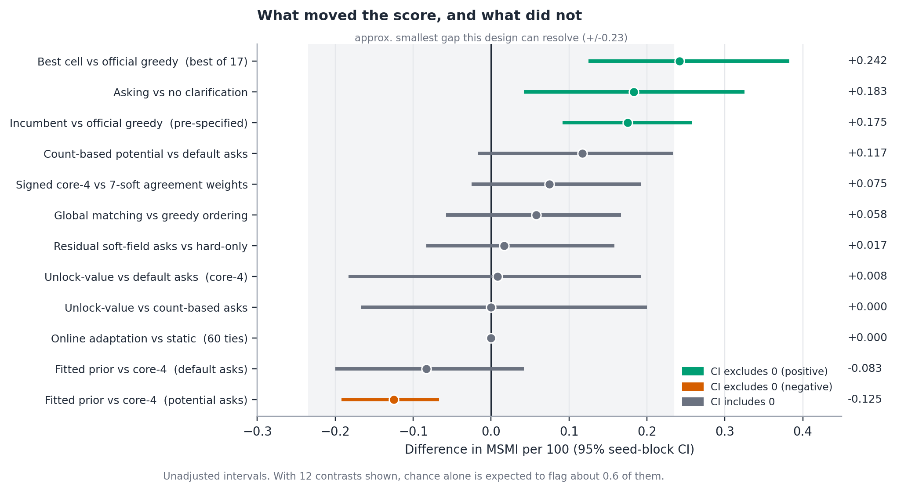
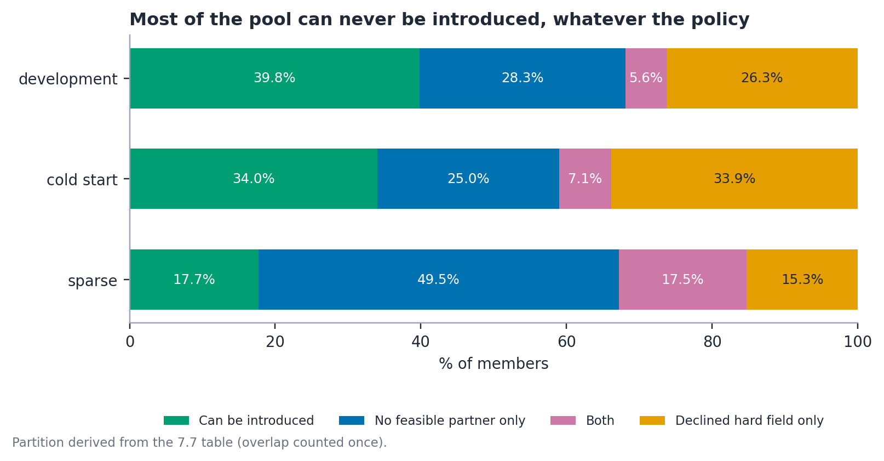

# The One Introduction Problem · Bipartite Bard Round 1 lab

**A supply-constrained sequential matching policy: clarification targeting,
outcome-relevant weighting, and variance-aware evaluation.**
Round 1 research submission for the *Vouchsafe Sequential Matching Hackathon*,
built entirely on the organisers' public synthetic simulator (starter release 1.0.0).

**Team:** Bipartite Bard · **Lead/members:** Anadi Tripathi · **Institution:** IIT Madras
**Submission note:** [`research/RESEARCH_NOTE_ROUND1_rev3.pdf`](research/RESEARCH_NOTE_ROUND1_rev3.pdf)
(compact, figure-driven) · full note:
[`research/RESEARCH_NOTE_ROUND1_rev2.pdf`](research/RESEARCH_NOTE_ROUND1_rev2.pdf)

> **Status (9 Oct 2026).** All headline numbers reproduce the lab's published rows:
> the three official baselines re-verified through the organisers' reference
> evaluator, 54/54 episodes identical
> ([`research/VERIFICATION_2026_10_09.md`](research/VERIFICATION_2026_10_09.md)).
> Everything below is exploratory public-seed evidence; honesty labels at the bottom.

## At a glance

1. **Supply, not ranking, sets the score.** Coverage ceilings are 0.399 / 0.341 / 0.178
   (development / cold start / sparse); all sixteen asking configurations land at
   97 to 98% of ceiling.
2. **Asking at all is the step function:** any ask rule beats no clarification,
   +0.183 MSMI/100, CI [+0.042, +0.325]; all 16 ask-vs-no-ask intervals exclude zero.
3. **Pre-specified incumbent vs official greedy:** +0.175, CI [+0.092, +0.258],
   p = 0.016, 23 wins / 29 ties / 8 losses; on the seven fresh seeds alone, +0.143.
4. **Among competent ask-and-match rules almost nothing separates:** 13 configurations
   span 0.400 to 0.592; only 3 of 78 pairwise intervals exclude zero (weight coding and
   global matching).
5. **Perfect information buys almost nothing:** an oracle with free complete
   clarification reaches coverage 0.298 vs 0.297, one extra assignment per episode.

## Key figures

Full set of eight in [`research/figures/`](research/figures/); the four core results:

**Which configurations score highest? Mostly the intervals overlap.**


**Where introductions are lost on the way to an MSMI.** Mutual acceptance is the
largest single count-level loss, and the one stage pair selection touches.


**What moved the score, and what did not.** Only asking-vs-nothing and the
pre-specified incumbent contrast exclude zero with margin.


**Most of the pool can never be introduced, whatever the policy.**


Also in the set: coverage vs the structural ceiling
([fig2](research/figures/fig2_coverage_vs_ceiling.png)), per-family heatmap
([fig3](research/figures/fig3_family_heatmap.png)), the oracle ladder
([fig5](research/figures/fig5_oracle_ladder.png)) and askable-population saturation
([fig7](research/figures/fig7_askable_saturation.png)).

## Repository map

```
starter/                     organisers' public kit, unchanged (own MIT notice)
tests/test_smoke.py          smoke test
experiment_lab.py            episode harness: labels, seed-block bootstrap CI, sign-flip test
scaled_factorial.py          10-seed x 6-family factorial runner (17 configurations)
soft_ask_screen.py           3-seed soft-question pilot (72 episodes)
soft_ask_validation_7seeds.py  7-seed held-out soft-question follow-up (42 episodes)
run_suite.py, run_controls.py, phase_screen.py,
phase_hybrid_policy.py, corrected_learning_rerun.py,
checkpoint_diagnostics.py    prior-phase exploratory scripts (see archive note below)
make_research_figures.py     supplementary figure generator (method diagram etc.)
make_report.py               report helper
tools/build_research_note.py note assembly helper
results/                     every run output: JSON/CSV aggregates used by the note
research/                    notes, PDFs, builders, provenance, verification, figures
CHECKLIST.md                 owner actions before/after submission
SHA256SUMS.txt               checksums of packaged files
```

## Reproducing the numbers

| Result | Command / source | Output |
|---|---|---|
| Official-baseline verification (54/54 identical) | organisers' `evaluate.py` + `policy.py`, trusted-local mode | `results/reference_verification_3seeds.json` |
| 10-seed factorial (360 episodes) | `python3 scaled_factorial.py` | `results/scaled_factorial_10seeds.json`, `results/scaled_factorial_summary.csv` |
| Soft-ask pilot and holdout | `python3 soft_ask_screen.py`, `python3 soft_ask_validation_7seeds.py` | `results/soft_ask_holdout_aggregate.csv` |
| Figures in `research/figures/` | generated from the checked-in aggregates (no simulation) | `research/figures/fig1..8` |
| Submission PDFs | `python3 research/build_pdf_rev2.py`, `python3 research/build_pdf_rev3.py` | `research/RESEARCH_NOTE_ROUND1_rev2/rev3.pdf` |

Round 1 harness scripts named in the note's artifact index (`scripts/` directory:
structure/supply diagnosis, rollout logging, prior fitting, oracle ladder, ask
timing, attainable ceiling) plus `results/analysis.json`,
`results/primary_summary.csv` and `results/ask_timing.json` live on the author's
working machine and are **pending push**; they are listed, never reconstructed,
in [`research/PROVENANCE_AND_ARTIFACT_STATUS.md`](research/PROVENANCE_AND_ARTIFACT_STATUS.md)
and [`research/ROUND1_NOTE.md`](research/ROUND1_NOTE.md).

## Research note lineage

| File | What it is |
|---|---|
| `research/RESEARCH_NOTE_ROUND1.pdf` | first uploaded PDF (kept as submission record) |
| `research/RESEARCH_NOTE_ROUND1_rev2.pdf` | full corrected note, 26 pp, native math |
| `research/RESEARCH_NOTE_ROUND1_rev3.pdf` | compact revision: 9 body pages + appendix, 8 figures |
| `research/RESEARCH_NOTE_FINAL.md` / `RESEARCH_NOTE_REV3.md` | sources of rev2 / rev3 |
| `research/rev2_numeric_diff.txt`, `rev2_math_manifest.json` | acceptance-test evidence |

## Prior-phase archive (exploratory, superseded)

`experiment_log.md`, `research/SIMULATION_OVERVIEW_AND_REQUIREMENTS_AUDIT.md`,
the `phase_*` / `corrected_learning_rerun` / `checkpoint_diagnostics` scripts and
the pilot JSONs document the pre-Round-1 pilot and phase screens. They are kept
for provenance; their numbers are **not** Round 1 claims, and their original
charts were superseded by the figure set above (the audit's embedded charts now
point at the new figures).

## Honesty labels (apply to everything here)

Exploratory public-simulator evidence · public seeds only · unadjusted p-values ·
in-process timings (not official per-invocation or Docker timings) · fully
synthetic data · not private evaluation, not real-user evidence, not evidence of
product effectiveness. Analysis-only scripts read simulator ground truth and are
never imported by any policy at inference time. AI tools used: Arena.ai Agent
Mode plus additional LLM chat assistants (ideation, debugging, drafting, review);
every number was checked against the simulator, the specification or publisher
records.

Starter kit unchanged, upstream commit `a8e26b35118cfa8e886a02f93984923e43ab64f6`
(`starter/SOURCE.md`). No separate code license is asserted by this bundle.
