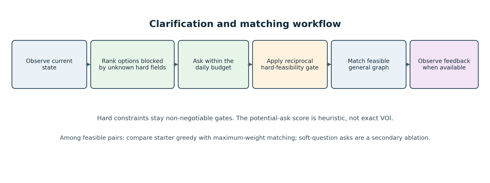
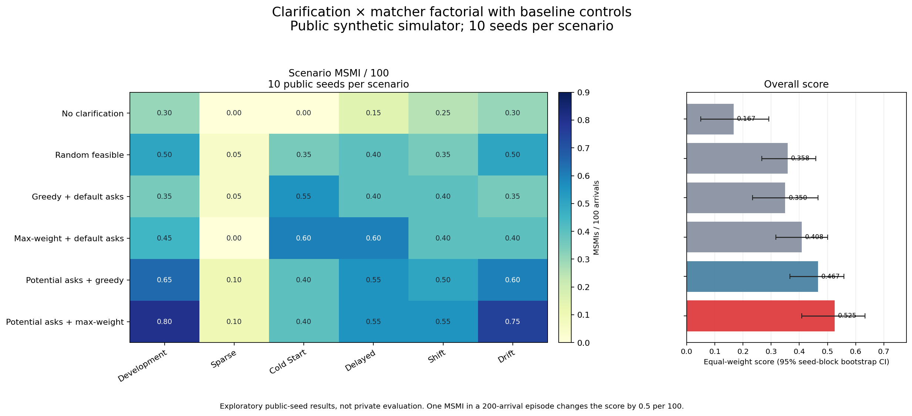
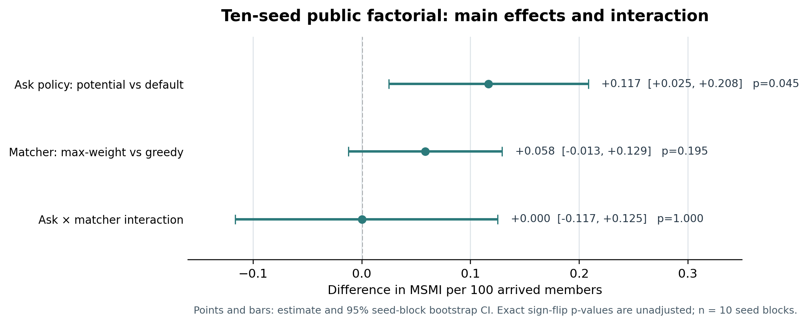
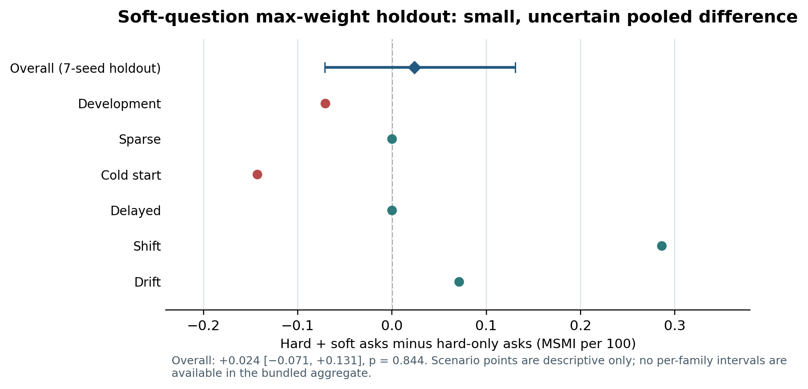

# Budgeted Clarification for Sequential Matching
## Public-simulator evidence on hard-constraint queries and general-graph allocation

**Research note draft — for team review**  
**Author(s):** [complete before submission]  
**Date:** 9 October 2026  
**Scope:** public synthetic simulator only

### Abstract

We examine how limited clarification and matching choices interact in a sequential-matching simulator with reciprocal hard constraints. A potential-ask heuristic prioritizes currently available members whose unknown hard constraints may block promising candidate edges; after clarification, all known hard constraints remain absolute gates. We compare greedy allocation with maximum-weight matching on the feasible general graph. The main public experiment is a matched clarification-policy × matcher factorial across six scenario families and ten public seeds per family, with three supplied controls. The estimated ask-policy main effect is +0.117 MSMI per 100 arrived members (95% seed-block bootstrap CI [+0.025, +0.208], exact sign-flip p = 0.0449, unadjusted); the matcher effect is smaller and uncertain. The ask advantage reverses in cold start. A separate soft-question pilot uplift did not replicate convincingly in a seven-seed public holdout. These findings are exploratory synthetic-simulator evidence—not private evaluation, Docker validation, real-user evidence, or proof of product effectiveness.

**Research question.** Under limited query budget and reciprocal hard feasibility, does targeting clarifications to unlock promising potential pairs improve the primary simulator outcome, and does a global maximum-weight matcher add value over the supplied greedy matcher?

---

## 1. Problem and simulator setting

The simulator presents a sequential matching problem over a general undirected compatibility graph. People arrive over a decision horizon, and a policy may gather information and produce introductions subject to availability, history, and reciprocal constraints. The experiment uses 60 decision days followed by a 40-day feedback period. Outcome feedback can mature after the action horizon; only feedback observable at decision time may inform an online policy.

### Feasibility and information

A pair is eligible only when all known reciprocal hard constraints pass. Examples include age-range constraints, explicit `who_to_meet`, relationship-structure agreement, smoking and children rules, acceptable-zone checks, and at least one schedule overlap. A known hard failure rules out a pair; an unknown hard field blocks the pair until it is clarified. Soft preferences inform ranking among feasible pairs and never override a hard failure. Simulator zones are fictional labels, not geographic coordinates or adjacency relationships.

Clarification has a daily budget of 12 units. The bundled `constraints` question costs 3 units; a named soft-field question costs 1. Unused daily units do not carry forward. A declined answer remains unknown. These are simulator mechanics and must not be presented as a real-world consent or data-collection result.

### Outcome

The primary outcome is a qualifying mutual second-meeting intention (MSMI), reported per 100 members arrived by the end of the decision horizon. A qualifying event requires the simulator’s timing and feedback conditions; an assignment, an acceptance, or a first date alone is not an MSMI. The primary aggregate gives equal weight to the six scenario-family means rather than pooling all arrivals across scenarios. Coverage, assignments, mutual acceptances, dates, clarification spend, missing feedback, and waiting time are secondary descriptive measures.

---

## 2. Related work and hypotheses

Online matching provides the main algorithmic context. Karp, Vazirani, and Vazirani’s Ranking result is foundational for online **bipartite** matching [1]. It is relevant background, but its model and guarantees do not directly transfer to this simulator’s general-graph, reciprocal-feasibility setting. Work on online matching with general arrivals is a closer model-family reference [2], though the simulator’s daily batch decisions and clarification actions still make the setting distinct.

The query policy is motivated by cost-aware information acquisition. Active feature-value acquisition studies when collecting additional information is worth its cost [3]. Here, that connection is conceptual: the potential-ask policy is a transparent heuristic over currently blocked edges, not a learned or exact expected-value-of-information policy.

### Hypotheses tested

- **H1 — targeted hard clarification:** with the matcher held fixed, prioritizing people whose unknown hard constraints may block plausible pairs can improve MSMI relative to default clarification.
- **H2 — global allocation:** with the ask policy held fixed, maximum-weight general-graph matching may improve MSMI relative to greedy matching by reducing allocation conflicts.
- **H3 — component interaction:** the effect of the ask policy may depend on the matching procedure. The interaction is estimated rather than assumed away.

These are hypotheses, not established properties of the simulator or evidence about real users.

---

## 3. Proposed approach

The policy separates information gathering from allocation. First, it decides which available people to ask about. Then it refreshes the observation, applies reciprocal hard-feasibility checks, and chooses a valid set of non-conflicting pairs. This makes the ask and matcher components independently ablatable.

**Figure 1.** Workflow used to organize the policy comparison. Known hard constraints remain gates; the potential-ask ranking is heuristic, not exact VOI.

### Ask policy

The `potential_ask` heuristic ranks available members by how many plausible currently blocked edges could become usable if their missing hard constraints were known. It prioritizes the hard-constraint bundle under the daily budget. The method does not query hidden simulator truth, inspect future arrivals, or calculate a full posterior expected utility. Default asks follow the starter routine. The no-ask control spends no clarification units.

### Matching policy

The greedy control uses the supplied starter matching procedure. The maximum-weight policy constructs the currently feasible **general graph**, scores an edge using observed agreement across seven soft fields, and solves a maximum-weight matching subject to non-overlap. Hard eligibility is checked before scoring. This is not a bipartite Hungarian assignment problem. Both matchers operate only on information the policy is allowed to observe.

### Soft-field follow-up

A separately implemented secondary arm spends additional units on selected soft fields after hard-feasibility clarification. It is reported as exploratory because the three-seed screen influenced which arm was followed up. Soft questions are not part of the central hypothesis or the primary factorial.

---

## 4. Evaluation design

The primary experiment crosses two clarification policies (default, potential ask) with two matchers (greedy, maximum-weight). Three controls extend the comparison: no clarification with greedy matching, random feasible matching, and default clarification with maximum-weight matching. The same public seed/scenario worlds are reused across policies.

| Component | Design |
|---|---|
| Public scenario families | development, sparse, cold start, delayed, shift, drift |
| Public seed blocks | 10 per family: 101, 202, 303, 404, 505, 606, 707, 808, 909, 1010 |
| Matched worlds | 60 (6 families × 10 seeds) |
| Policy–world rows | 360 (6 methods × 60 worlds) |
| Primary outcome | Equal-weight mean across family means of MSMI per 100 arrived members |
| Uncertainty | 95% bootstrap intervals resampling ten seed blocks |
| Paired test | Exact two-sided sign-flip test on ten seed-block differences |
| Secondary outcomes | Coverage, assignments, mutual acceptances, dates, ask spend, missing feedback, waiting time |

The core intervals use 10,000 seed-block bootstrap draws (analysis seed 20261009); exact sign-flip tests use the ten seed-block differences. The tests are exploratory and not adjusted for the number of contrasts. The first three public seed blocks had been used in earlier pilot work, so the core factorial is not a fully independent preregistered confirmation. Episodes are matched by public world; 360 policy–world rows are not 360 independent worlds.

### Secondary soft-question design

A three-seed screen compared hard-only and hard-plus-targeted-soft querying with both matchers. After seeing the screen, hard-plus-soft max-weight matching was evaluated on seven additional public seed blocks paired against the existing hard-only max-weight outcomes. This follow-up is a useful holdout within the public simulator, but remains exploratory and does not substitute for the primary factorial or a private evaluation.

---

## 5. Primary results

All 360 core factorial episodes completed with valid simulator actions in the in-process runner. Higher MSMI/100 is better. The central estimate is the mean of six equally weighted scenario-family means; the intervals below resample public seed blocks.

| Method | MSMI / 100 | 95% seed-block CI | MSMI events / 60 episodes | Mean coverage | Mean ask units / episode |
|---|---:|---:|---:|---:|---:|
| No clarification + greedy | 0.167 | [0.050, 0.292] | 20 | 0.120 | 0.0 |
| Random feasible | 0.358 | [0.267, 0.458] | 43 | 0.342 | 196.8 |
| Greedy + default asks | 0.350 | [0.233, 0.467] | 42 | 0.343 | 196.8 |
| Max-weight + default asks | 0.408 | [0.317, 0.500] | 49 | 0.342 | 196.8 |
| Potential asks + greedy | 0.467 | [0.367, 0.558] | 56 | 0.342 | 196.7 |
| **Potential asks + max-weight** | **0.525** | **[0.408, 0.633]** | **63** | **0.343** | **196.7** |

**Figure 2.** Scenario-family means and primary-score intervals for six policies. The cold-start reversal and near-zero sparse outcomes should remain visible in interpretation.

The potential-ask policy has the highest mean in this public screen, but the result is heterogeneous. Against default asks, potential asks improved development and drift means; in cold start, the difference was −0.150 MSMI/100 with greedy matching and −0.200 with max-weight matching. Sparse outcomes remained rare. A single event can move an episode score substantially, so small point differences should not be overread.

---

## 6. Factorial contrasts and secondary outcomes

Averaged over the two matchers, the ask-policy main effect was **+0.117 MSMI/100** (95% CI **[+0.025, +0.208]**, exact sign-flip *p* = **0.0449**, unadjusted). The matcher main effect was **+0.058** (95% CI **[−0.013, +0.129]**, *p* = **0.195**). The ask × matcher interaction was approximately **0.000** (95% CI **[−0.117, +0.125]**, *p* = **1.000**). The ask result against default greedy is clearer than the contrast against default max-weight; no multiplicity correction was used.

**Figure 3.** Main effects and interaction from the ten-seed public factorial. Bars show 95% seed-block bootstrap intervals. Exact sign-flip *p*-values are unadjusted; *n* = 10 seed blocks.

The secondary metrics are consistent with a possible improvement in later stages of the introduction funnel, but do not establish a real-world mechanism:

| Method | Assignments | Mutual accepts | Dates | MSMIs | Missing feedback |
|---|---:|---:|---:|---:|---:|
| Greedy + default asks | 77.35 | 10.75 | 8.52 | 0.70 | 40.33 |
| Max-weight + default asks | 76.57 | 11.15 | 8.58 | 0.82 | 40.87 |
| Potential asks + greedy | 76.52 | 11.68 | 9.05 | 0.93 | 39.17 |
| Potential asks + max-weight | 76.40 | 12.12 | 9.33 | 1.05 | 39.43 |

Values are mean counts per episode across the 60 public worlds per method. Coverage was essentially unchanged among the four ask/matcher arms. These outcomes are descriptive and do not prove that clarification caused improved pair quality outside the simulator.

---

## 7. Exploratory soft-question follow-up

The three-seed screen recorded **0.722 MSMI/100** (26 events) for hard-plus-targeted-soft + max-weight, versus **0.639** (23 events) for hard-only + max-weight: a +0.083 difference, W/T/L 3/15/0 across 18 matched worlds. This screen selected the max-weight arm for follow-up and should not be treated as confirmatory. The soft-only arms asked zero questions because no hard-feasible pairs were available to target; soft questions did not replace hard-feasibility clarification.

In the seven-seed public holdout (42 policy–world rows per arm), hard-plus-soft max-weight scored **0.500** versus **0.476** for hard-only max-weight. The paired difference was **+0.0238** (95% seed-block CI **[−0.0714, +0.1310]**, exact sign-flip *p* = **0.84375**, W/T/L 8/29/5; 42 vs 40 event totals). This does not establish a reliable average benefit. Soft questions cost about **82.8 extra ask units per episode**; coverage was approximately unchanged at 0.3407.

**Figure 4.** The pooled holdout interval spans zero. Scenario differences are point estimates only; the raw soft-holdout episode JSON was unavailable when this bundle was assembled, so per-family intervals are not plotted.

The holdout’s scenario differences were shift +0.286, drift +0.071, delayed 0, sparse 0, development −0.071, and cold start −0.143 MSMI/100. The combined ten-seed soft-arm contrast includes the pilot seeds used to choose the arm and is descriptive only. The appropriate conclusion is that the screen suggested a possible gain, but the held-out public evidence did not replicate it convincingly.

---

## 8. Discussion, limitations, and next steps

The most defensible finding is narrow: in these public synthetic runs, targeting clarification at potentially blocked hard-feasibility edges was associated with a positive average score difference, while the matcher effect was smaller and uncertain. The cold-start reversal argues against claiming a uniform benefit. The soft-question follow-up is inconclusive and costly in ask units relative to the small observed difference.

Important limitations:

1. **Synthetic and public only.** No private seed set, private evaluator, real people, or real relationship outcomes were used. The results are not product-effectiveness evidence.
2. **Exploratory inference.** Outcomes are scarce and discrete; the core factorial uses ten public seed blocks, some already used in prior pilot work; tests are unadjusted across contrasts.
3. **Scenario heterogeneity.** Cold-start results reverse the average ask effect; sparse outcomes are close to zero. Do not hide these cases.
4. **Heuristic query selection.** Potential ask is not exact VOI and does not estimate a calibrated causal benefit for each question.
5. **Execution mode.** The main factorial was run in-process. Reported timings are not the official per-invocation or Docker timings. No Docker evaluation has been completed.
6. **Soft-run artifact gap.** The analysis summary is available, but row-level JSON produced on the user's VM was not in the workspace bundle. The soft-run charts therefore use documented aggregates and are labelled accordingly.

A next version should first add the missing soft-run raw artifacts and preserve their checksums. Any further evaluation should be planned in advance, use paired worlds, report all scenario families, and use the organizers' permitted evaluator when available. These are future steps; they have not been completed in this note.

---

## 9. Conclusion, reproducibility, and references

This note reports a public-simulator experiment on budgeted clarification and sequential matching. The ten-seed factorial suggests that a hard-constraint potential-ask heuristic may matter more than changing the matcher, but uncertainty, cold-start reversal, unadjusted testing, and synthetic-only evaluation require conservative language. The targeted-soft-question uplift did not show a reliable benefit in its seven-seed public holdout. No claim is made about real-world compatibility, private performance, or production readiness.

### Reproduction and provenance

The episode-level 360-row factorial is in `results/scaled_factorial_10seeds.json`; the seven additional public seeds are in `results/scaled_factorial_extra_7seeds.json`. CSV summaries and the core heatmap are included. Run `python make_scaled_factorial_heatmap.py` and `python make_research_figures.py` to rebuild figures from the bundled JSON and aggregate CSV; these commands do not run new episodes. Python dependencies are pinned in `requirements.txt`. The original organizer `starter/kit.py` is bundled unchanged with its MIT license and source commit metadata. The research note is a draft; author identity and declaration details require team review.

### References

1. Karp, R. M., Vazirani, U. V., & Vazirani, V. V. (1990). An Optimal Algorithm for On-line Bipartite Matching. *Proceedings of STOC ’90*, 352–358. https://doi.org/10.1145/100216.100262
2. Gamlath, B., Kapralov, M., Maggiori, A., Svensson, O., & Wajc, D. (2019). Online Matching with General Arrivals. *Proceedings of FOCS 2019*, 26–37. https://doi.org/10.1109/FOCS.2019.00011
3. Saar-Tsechansky, M., Melville, P., & Provost, F. (2009). Active Feature-Value Acquisition. *Management Science*, 55(4), 664–684. https://doi.org/10.1287/mnsc.1080.0952

**Code and simulator provenance:** Organizer's public starter kit, release 1.0.0, upstream commit `a8e26b35118cfa8e886a02f93984923e43ab64f6`; see `starter/SOURCE.md`, `starter/LICENSE`, and `starter/DATA_LICENSE.md`.
