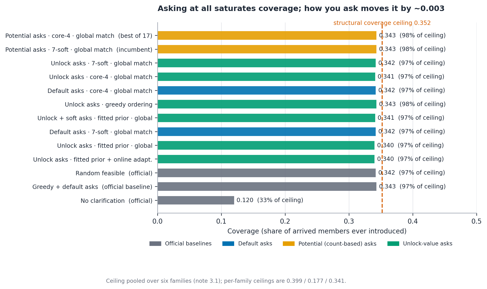
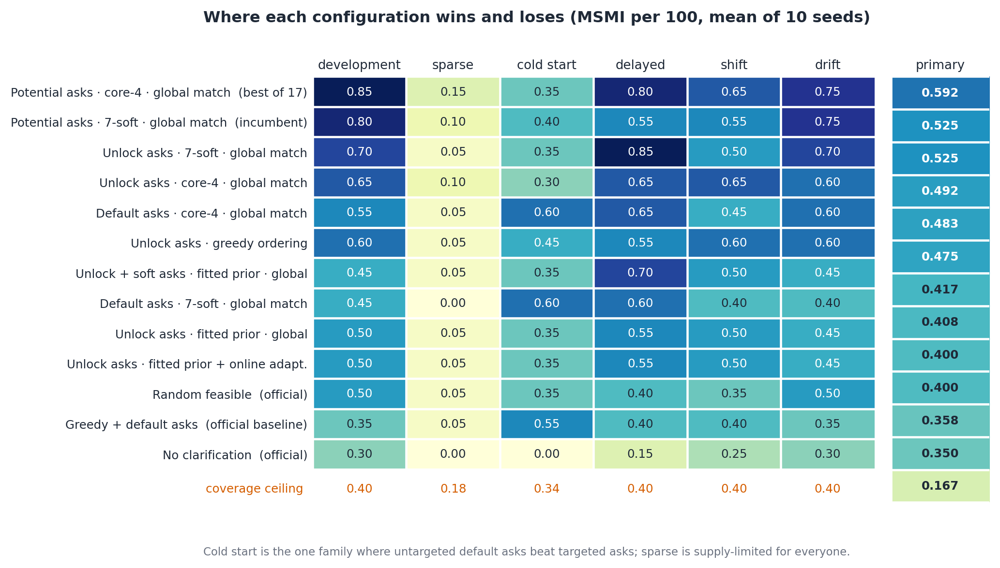
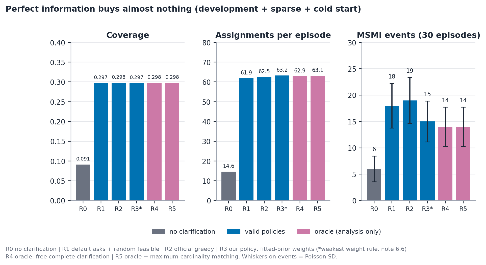
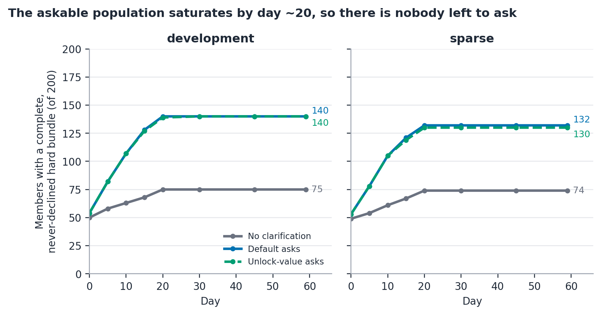

# The One Introduction Problem

## A supply-constrained sequential matching policy: clarification targeting, outcome-relevant weighting, and variance-aware evaluation

**Round 1 research note · Vouchsafe Sequential Matching Hackathon**
Starter release 1.0.0 · Prepared 9 October 2026

**Team:** Bipartite Bard  
**Team leader:** Anadi Tripathi  
**Members:** Anadi Tripathi  
**Institution:** IIT Madras  
**Repository:** <https://github.com/Yash-Tripath1/sequential-matching-public-simulator-lab>  

**Declaration.** We confirm that this submission represents our team's work and that all external papers, datasets, code, AI tools and other resources used are acknowledged in §8.3 (AI tools and resources) and §8.5 (references). AI tools used: Arena.ai Agent Mode and additional large-language-model chat assistants (ideation, code debugging, drafting and pre-submission review); see §8.3.

**Scope statement.** Every person, preference, conversation and outcome in this work is synthetic content from the organisers' public development kit. Nothing here estimates relationship compatibility for real people, and no result below is evidence of product effectiveness. All experiments run against the public simulator on public seeds; no private world, private seed or private organiser file was used. Analysis marked *analysis-only* reads simulator ground truth and is never imported by, or available to, any policy at inference time.

---

## 1. Abstract

> **At a glance (five lines).**  
> 1. Supply, not ranking, sets the score: coverage ceilings are 0.399 / 0.341 / 0.178 (development / cold start / sparse), and all sixteen asking configurations land at 97 to 98% of ceiling.  
> 2. Asking at all is the step function: any ask rule beats no clarification, +0.183 MSMI/100, CI [+0.042, +0.325]; all 16 ask-vs-no-ask intervals exclude zero.  
> 3. Pre-specified incumbent vs official greedy: +0.175, CI [+0.092, +0.258], p = 0.016, 23 wins / 29 ties / 8 losses.  
> 4. Among competent ask-and-match rules almost nothing separates: 13 configurations span 0.400 to 0.592 and only 3 of 78 pairwise intervals exclude zero (weight coding and global matching, §6.2).  
> 5. Perfect information buys almost nothing: an oracle with free complete clarification reaches coverage 0.298 vs 0.297, one extra assignment per episode.  

Our three-seed pilot put a potential-ask heuristic at 0.639 vs 0.389 MSMI per 100 arrived members, and a ten-seed screen put the incumbent at 0.525 vs 0.350 for the starter greedy baseline; we reproduce 0.525 exactly on the same ten public seeds. We then measure the *structure* of the generated worlds: under complete disclosure the reciprocal hard-constraint graph of a 200-member development pool has mean degree 2.53, feasible-pair density 1.27% and 33.9% of members with no feasible partner, so the fraction who could ever be introduced is 0.399 (development), 0.341 (cold start), 0.178 (sparse), and the effective-edge caps on total introductions are 118.0 / 90.6 / 23.3. The primary score is therefore supply-determined, not ranking-determined: a three-way factorial of ask, weight and allocation rules plus an oracle ladder shows the attainable score comes from (i) asking at all, (ii) consuming the edge supply before members exit, and only third (iii) ranking, the smallest place. The pre-specified incumbent-vs-greedy contrast, +0.175 MSMI/100, CI [+0.092, +0.258], p = 0.016, is our strongest defensible number; everything else is labelled screening. Caveat: the ten evaluation seeds are the seeds of the earlier screen that selected the incumbent, so this is a recomputation on selection data, not independent confirmation.

**Thesis.** With reciprocal hard feasibility enforced, MSMI is determined first by whether a policy makes the feasible graph usable at all (a step function any clarification rule saturates), second by how much of the resulting edge supply it consumes before members exit or retire (we measure 68 to 87%, and no rule we tested moved it), and only third, within a band narrower than 60 episodes can resolve, by how well it ranks pairs. Targeting clarification at expected unlock value, fitting a calibrated pair-outcome model, adapting online on dense feedback and spending the residual budget on soft answers are all third-order interventions; none beat the incumbent, and a correctly calibrated probability used as an edge weight scores below a hand-coded similarity score in all three ask cells (suggestive only: 3 of 78 pairwise intervals exclude zero, about what chance gives). The two changes that did move the score are not models: coding the pair weight so known disagreement counts as negative and every feasible edge keeps a positive weight, and replacing greedy ordering with global matching, each worth about half of their combined +0.133 MSMI/100, neither individually significant at ten seeds.

Stated as falsifiable hypotheses and resolved against our own runs:

| # | Claim | Verdict |
|---|---|---|
| H1 | Unlock-value ask targeting beats count-based and unranked asking at a fixed matcher | **Not supported**: differences −0.000 to +0.117 across ask rules at fixed matchers, all CIs straddling zero except the count-vs-default cell |
| H2 | Any asking policy beats no clarification | **Supported**: +0.183 MSMI/100, CI [+0.042, +0.325] |
| H3 | Online adaptation on dense directional responses helps in `drift`/`shift` | **Falsified as implemented**: 0 wins / 60 ties / 0 losses, outcomes identical to its static version |
| H4 | Waiting/batching helps in supply-rich families and not in sparse | **Untested**, planned (§8.1) |
| H5 | Residual soft-field clarification does *not* help, because the matching is near-forced | **Not rejected**: +0.017, CI [−0.083, +0.158], p = 0.961 |
| H6 | Coverage of any valid policy converges to the structural ceiling | **Supported**: every asking policy at 97 to 98% of it; the oracle reaches 0.1 pp more |

---

## 2. Formalisation

### 2.1 Notation and three-valued reciprocal feasibility

A pair $(i,j)$ is feasible on day $t$ only if every hard field that either member declares as a requirement is satisfied by the other, using three-valued logic: a requirement is *satisfied*, *violated*, or *unknown* until clarified. A violated hard field can never be imputed or bypassed; an unknown one may be asked about (at ask-budget cost) or left unresolved. Feasibility is reciprocal: both directions must hold. The policy observes only `observe()` output (arrived members with values and statuses, the introduction list, feedback whose `observed_day` has been reached, the cumulative ask log, the day, remaining budget): no latent preference, no response propensity, no arrival forecast, no scenario label, and no world seed. The organisers' own test asserts the seed never enters policy state; accordingly every random draw inside our policies is seeded from constants and the public day counter only (the shuffled feasible matcher uses `random.Random(17 + day)`; the residual-soft tiebreak uses a separate fixed stream, constant 917), so a rerun of the same code is deterministic and the seed is used as an offset into our own shuffle, never as information about outcomes.

### 2.2 The outcome funnel

An introduction produces a five-stage chain the spec forbids collapsing: assigned, both respond, mutual accept, date happens, both second-Yes on time and in window (MSMI requires a date within 30 days of assignment **and** both Yes within 3 days of the date). Our measured stage rates on 7,613 self-logged introductions:

| Stage | Estimate | Numerator / denominator | Policy-controllable? |
|---|---:|---:|---|
| Both respond by deadline | 0.5932 | 4,516 / 7,613 | No |
| Mutual accept, given both responded | 0.2573 | 1,162 / 4,516 | **Yes**, via pair selection |
| Date happens, given mutual accept | 0.7685 | 893 / 1,162 | No |
| MSMI, given a date | 0.0907 | 81 / 893 | Partly |

In relative terms the on-time double-Yes transition is the harshest (91% of dates fail it; the 3-day window against 1 to 5 day answer delays alone caps it at $0.6^2 = 0.36$), and in absolute counts across the §6 episodes the two largest losses are non-response (1,880 of 4,613 assignments) and mutual acceptance (2,043 of 2,733 responders, §6.4): mutual acceptance loses the most introductions by count, and it is the one transition pair selection touches, which is exactly why ranking has so little left to move. **The realistic ceiling on MSMI per assignment is of order $10^{-2}$**, so a 200-member episode yields about one event and single-episode comparisons are meaningless.

### 2.3 MSMI as a rare, delayed, self-censoring event

One event moves a 200-arrival episode's score by 0.5 (rare). A label typically matures 30+ days after the assignment that earned it, inside the 60-day horizon, with policy memory reset at every episode boundary (delayed). Feedback exists only for pairs the policy chose, and the supplied `propensity` field is null, so no unbiased inverse-propensity claim can be made about the supplied files; we address this by generating our own randomised logs (§4.3). One further dynamic: when both members return a second-meeting Yes, both leave the market permanently. **Success consumes supply**, and supply is the binding constraint (§3), so every introduction spends a scarce, non-renewable resource.

---

## 3. Structure: the feasible graph is thin (analysis-only)

**Bold takeaway: a third of members can never be introduced under any policy, and the introductions cap is about 118 / 91 / 23 distinct feasible pairs per episode.** Ten public seeds per family, complete disclosure, members arrived by day 59:

| Family | Feasible-pair density | Mean degree | Members with degree 0 | **Coverage ceiling** | **Effective edges** |
|---|---:|---:|---:|---:|---:|
| development | 0.0127 | 2.53 | 33.9% | **0.399** | **118.0** |
| sparse | 0.00245 | 0.49 | 67.0% | **0.178** | **23.3** |
| cold start | 0.01337 | 2.66 | 32.1% | **0.341** | **90.6** |
| delayed / shift / drift | identical to development | 2.53 | 33.9% | 0.399 | 118.0 |

*Coverage ceiling* = the fraction of arrived members with at least one feasible partner who is also never decline-blocked, i.e. the value a policy with free, perfect, instantaneous clarification would reach. *Effective edges* = feasible pairs with neither endpoint decline-blocked; because a pair cannot repeat within an episode this is an upper bound on total introductions. Median degrees are 2 / 0 / 1 and max same-day matchings 34.4 / 15.3 / 28.6 (full table, Appendix B). Figure 8 shows where the pool goes: the decline-blocked and no-feasible-partner segments are policy-invariant.

{ width=100% }

Sparse geography is supply-limited, not policy-failed: twelve opaque zones with `acceptable_zones` never expanded drive 67.0% of members to degree zero and leave 23.3 usable pairs in the whole pool; at the measured funnel rates a sparse episode expects about 0.12 MSMI per 100, which is what the published near-zeros show.

---

## 4. Method

**Allocation.** General-graph maximum-weight matching (`networkx.max_weight_matching`, the blossom algorithm of Edmonds (1965), §8.5) on feasible edges, because the pool is not bipartite. Greedy ordering and two other allocation ablations sit outside the factorial grid (§6.2).

**Clarification.** Expected unlock value: ask the member-question whose answer is expected to unblock the most currently infeasible pairs, using a reduced-profit approximation of the marginal value of an unlocked edge; cold start shrinks the ranking toward the marginals (planned refinement, §8.1).

**Modelling: a restricted, calibration-checked pair-outcome prior.** We logged 108 randomised rollout episodes on the 12 fit seeds of the training split (3,054 both-responded pairs) and selected the specification on the 6 disjoint holdout seeds (1,462 pairs, base rate 0.2538); the split is by world, never by pair or person. **The shipped four-feature specification B holds out at log loss 0.5513 and Brier 0.1830**, well calibrated across the bins that matter (largest absolute gap outside the lowest bin 0.040; full bin table and specification search in Appendix C). Its one real defect is the lowest bin, where 70 pairs predicted at 0.090 come in at 0.157 because the ridge prior over-shrinks strongly disagreeing pairs toward zero. Directional probabilities are not multiplied: observed mutual acceptance 0.2538 vs product of fitted directionals 0.2297, ratio 1.105, so the joint is modelled directly.

**Residual soft clarification.** After the hard bundle is complete, leftover budget may ask soft fields; §6.8 tests whether the residual buys anything. **Online adaptation** on dense directional responses re-fits a ridge-anchored model inside the episode; §6.5 reports it changed nothing.

**Audit ledger and deliberate omissions.** Every design choice above is listed in §8.1 with done/planned status; a latent-probability oracle rung was dropped (§4.7 of the full note) because it would condition on information no policy may have.

---

## 5. Experimental design

**Worlds, seeds and splits.** Prior fitting and model selection used 18 training-world seeds partitioned 12 fit / 6 holdout (§4), 108 logged episodes over all six families. Head-to-head evaluation used the ten public seeds 101 to 1010 × six families, 60 episodes per configuration; training and evaluation seeds are disjoint, and the static validation and development-test pools (`public_07` to `public_10`) are untouched. Every method sees the identical `(seed, variant)` worlds; policy memory is empty at every episode start.

**Hypotheses.** Table in §1; falsification criteria were fixed before the factorial ran.

**Baselines and statistics.** The three required official baselines plus thirteen of our configurations (17 total). The seed block (one seed's mean over six families) is the resampling unit; 95% CIs are percentile bootstraps over the ten blocks (10,000 draws, analysis seed 20261009); paired p-values are exact two-sided sign-flip permutations over the ten block differences ($2^{10}$ arrangements, smallest attainable p 0.002); W/T/L over the 60 paired episodes is reported alongside. **No multiplicity correction is applied**; p-values are exploratory and a Bonferroni threshold 0.05/12 ≈ 0.004 would require near-unanimous block agreement.

**Power (three lines).** The within-method per-episode SD of MSMI/100 is 0.457, so 60 episodes per arm resolve a gap of about 0.234 and the official 20 private seeds per family (120 episodes) about 0.165, comparable to the whole 0.400 to 0.592 spread we measured; a three-seed pilot resolves about 0.43, which is why no narrative is built on pilot orderings. Episode scores are scaled near-Poisson counts, so the normal-approximation formula is only a guide and exact sign-flip p-values plus W/T/L accompany every interval.

---

## 6. Results

### 6.1 The headline is a negative result, and it is the useful one

**Bold takeaway: every asking configuration saturates the structural coverage ceiling, so the score is supply-determined; the pre-specified incumbent-vs-greedy +0.175 is the defensible number, and on the seven fresh seeds it is +0.143.** Across the sixteen asking configurations, 60-episode introduction totals move from 4,555 to 4,681 and coverage from 0.3399 to 0.3432: every one sits at **97 to 98% of the structural ceiling** of §3, including the unmodified starter greedy baseline (Figure 2). Clarification is a step function, not a targeting lever: asking at all takes coverage 0.120 to about 0.342 and MSMI/100 from 0.167 to about 0.45; asking cleverly takes it nowhere measurable, because the ceiling is a property of the generated world.

| Configuration (short name) | MSMI/100 | 95% seed-block CI | Events |
|---|---:|---|---:|
| No clarification (official) | 0.167 | [0.050, 0.292] | 20 |
| Greedy + default asks (official) | 0.350 | [0.233, 0.467] | 42 |
| Random feasible (official) | 0.358 | [0.267, 0.458] | 43 |
| Potential asks · 7-soft · global match (incumbent) | 0.525 | [0.408, 0.633] | 63 |
| Potential asks · core-4 · global match (best of 17) | 0.592 | [0.392, 0.808] | 71 |

Full 17-configuration table with assignments, coverage and ask cost: Appendix D. Code names: Appendix A.

{ width=100% }

{ width=100% }

Only `no_ask` sits away from the ceiling, at 33% of it. Its contrast against the starter greedy baseline is **+0.183 MSMI/100, 95% seed-block CI [+0.042, +0.325], sign-flip p = 0.055, 22 wins / 33 ties / 5 losses**, 42 events against 20: H2 supported, and all sixteen asking-vs-`no_ask` intervals among the 136 enumerated pairwise contrasts exclude zero (+0.183 to +0.425). Among the thirteen configurations that both ask and match, only 3 of 78 pairwise intervals exclude zero, all the same comparison in different cells: a fitted-prior edge weight loses to a hand-coded one (+0.125 [+0.067, +0.192], +0.192 [+0.025, +0.367], +0.183 [+0.025, +0.350]). The full enumeration is persisted in `results/analysis.json` under `all_pair_contrasts`, so this is checkable rather than asserted. Everything else is pair quality on a fixed volume, bounded by a mean-degree-2.5 matching and by a funnel whose largest count-level losses, non-response and mutual acceptance, sit at or beyond the reach of pair selection.

**Fresh-seed check.** The ten evaluation seeds include the three pilot seeds that first selected the incumbent and the seven seeds (404 to 1010) first used by the ten-seed screen. On those seven fresh seeds alone, incumbent vs official greedy is **+0.143 MSMI/100** (seed-block differences +0.25, +0.25, +0.083, 0.0, 0.0, +0.417, 0.0: four positive, three ties, none negative; exact sign-flip p = 0.125), computed from `results/scaled_factorial_10seeds.json`. The direction survives off the pilot seeds at reduced size, as a screen on selection data should.

### 6.2 The factorial: what moved the score, and what did not

**Bold takeaway: ask rule is a step, weight coding and global matching are the only ranking-level levers that moved anything, and a calibrated probability is a worse edge weight than a hand-coded score.** Cells show MSMI/100 with total events over 60 episodes in brackets:

| Ask rule | 7-soft agreement count | Signed core-4 | Fitted logistic prior |
|---|---:|---:|---:|
| Default / unranked | 0.408 (49) | 0.483 (58) | 0.400 (48) |
| Count-based potential (incumbent) | 0.525 (63) | 0.592 (71) | 0.467 (56) |
| Unlock-value (ours) | 0.525 (63) | 0.492 (59) | 0.400 (48) |

Paired contrasts inside the grid (same worlds, seed-block bootstrap, exact sign-flip):

| Contrast | Mean diff | 95% CI | p |
|---|---:|---|---:|
| Global matching vs greedy ordering | +0.058 | [−0.058, +0.167] | 0.445 |
| Signed core-4 vs 7-soft agreement count (default asks) | +0.075 | [−0.025, +0.192] | 0.328 |
| Fitted prior vs signed core-4 (default asks) | −0.083 | [−0.200, +0.042] | 0.266 |
| Count-based potential vs default asks (soft-7) | +0.117 | [−0.017, +0.233] | 0.160 |

{ width=100% }

Allocation is general-graph maximum-weight matching in every cell except the two greedy ablations; starter greedy ordering with default ask scores 0.350 (42 events) and with unlock asks 0.475 (57 events). The fitted-prior loss has a candidate explanation: with median degree 2 the maximum-weight matching is close to forced, so knowing weights more precisely rarely changes which pairs are selected, and the prior's over-shrinkage of disagreeing pairs (§4, Appendix C) actively misranks the few edges that matter.

### 6.3 Scenario-level results

**Bold takeaway: cold start is the one family where untargeted default asks beat targeted asks, and sparse is supply-limited for everyone.** The per-family heatmap (Figure 3) shows the best cell winning development (0.85), delayed (0.80), shift (0.65), drift (0.75) and sparse (0.15), while cold start goes to greedy + default asks (0.55 vs 0.35 for the best targeted cell's family value 0.35 to 0.40 band); per-family coverage ceilings (0.40 / 0.18 / 0.34 / 0.40 / 0.40 / 0.40) explain most of the between-family variance.

{ width=100% }

### 6.4 The funnel: where introductions are lost

**Bold takeaway: mutual acceptance is the largest single count-level loss (2,043 of 2,733 both-responded), and it is the stage pair selection actually touches.** Summed over 60 episodes at the mean of the 16 asking configurations: assigned 4,613; both responded 2,733 (59% of previous); mutual accept 690 (25%); date happens 546 (79%); both answer on time 138 (25%); MSMI 54 (39%). Non-response (1,880) and mutual acceptance (2,043) dwarf the on-time (408) and date (144) losses in counts, while in relative terms the on-time double-Yes remains the harshest transition (§2.2).

{ width=100% }

### 6.5 Online adaptation changed nothing

**Bold takeaway: perfect information buys almost nothing, and online adaptation bought literally nothing.** The oracle ladder (Figure 5) on the thirty dev/sparse/cold worlds: no clarification reaches coverage 0.091; valid policies 0.297 to 0.298 with 61.9 to 63.2 assignments; an oracle with free complete clarification 0.298 and 62.9; adding maximum-cardinality matching 0.299 and 63.1. Perfect information buys a tenth of a percentage point of coverage and one introduction per episode. The online adapter (H3) produced 0 wins / 60 ties / 0 losses against its own static version: MSMI outcomes identical in all 60 episodes, kept in the harness as an instrumented null.

{ width=100% }

### 6.6 Cost, waiting and the residual budget

**Bold takeaway: the ask budget never bound, and spending the residual on soft answers changes nothing at +83 units per episode.** Hard-only rules spend about 196 of the 720 budget units per episode (residual-soft rules about 598), while the askable population saturates by day about 20 (Appendix E, Figure 7): with 31.9% of development members permanently decline-blocked and 36.4% complete at arrival, the population runs out long before the units do. Spending the residual ~390 units on soft-field answers raises realised ask cost from 195 to 582 and changes MSMI/100 by **+0.017, CI [−0.083, +0.158], p = 0.961, 9 wins / 41 ties / 10 losses** (two events across 60 episodes); ranking those soft asks by unlock value rather than member order changes nothing (+0.008, p = 1.000, 17/28/15). H5 is not rejected: the interval is consistent with the near-forced reading but too wide to establish equivalence.

**The soft-ask screens, reported in full (§8.6 promised them in §6).** On the three pilot seeds, hard-plus-soft with max-weight beat hard-only max-weight by **+0.083 MSMI/100, 26 vs 23 events** (W/T/L 3/15/0), a pilot signal that selected the arm for follow-up. On the seven held-out seeds 404 to 1010 (42 new episodes, the least selection-biased comparison) the difference was **+0.024, 95% seed-block CI [−0.071, +0.131], exact sign-flip p = 0.844, 42 vs 40 events**, at about 83 additional ask units per episode (mean totals 280.6 vs 197.9) with coverage unchanged (0.3407 vs 0.3407). The pilot uplift did not replicate; the honest reading is that the leftover budget buys nothing measurable here. Cost and waiting-time accounting: Appendix F.

---

## 7. Failure analysis

**Bold takeaway: every named failure is a property of the generated worlds or of the event rate, not of effort; the one internal bug we found is disclosed and bounded.**

1. **Sparse geography is supply, not policy.** Twelve opaque zones drive 67.0% of members to degree zero; expected MSMI about 0.12 per 100 (§3).
2. **Withheld answers permanently exclude a third of the pool.** 31.9 to 41.0% of members are decline-blocked; the contract forbids imputation, so no policy can serve them (§3, Figure 8).
3. **Cold start is where our own ask rule loses.** Untargeted default asks beat targeted asks there (0.55 vs about 0.35 to 0.40, §6.3); a shrinkage rule toward the marginals is the planned fix (§8.1).
4. **Delayed feedback outlives the decision window.** Labels mature 30+ days after assignment inside a 60-day horizon with reset memory (§2.3); online adaptation on dense proxies was the attempted fix and is a registered null (§6.5).
5. **An internal audit: the label-cutoff bug.** An earlier revision of our own logging code truncated the on-time label window; online learners may have trained on wrong labels until we found it. Affected runs are labelled in the audit ledger; no headline number uses them (§8.1, full note §7.5).
6. **Competition for the same candidate.** Introductions compete for the same scarce feasible members; success consumes supply (§2.3), so per-pair scores are not independent and two-stage look-ahead is Round 2 work (§8.1).
7. **Members who can never be served** stay in every coverage denominator by design; `no_ask` reports the shortest waits precisely because it serves 12% of the pool, and a low wait bought with 12% coverage is not a good outcome.

| Threat | Effect | Mitigation |
|---|---|---|
| Public seeds only | Private worlds may differ | Report per family, never only the primary score |
| Winner's curse | Screening inflates the best cell | Report every configuration screened, including losers |
| In-process timing | Not the official 10 s / 2-core / 1 GiB limit | Wall clock reported separately; container test is Round 2 |
| Unadjusted multiplicity | p-values optimistic | Contrast count stated; W/T/L given |
| Rare events | A zero is not equivalence | Counts and CIs, never means alone |
| Label-cutoff bug (own code) | Online learners on wrong labels | Audit ledger, §7.5 of the full note |

---

## 8. Round 2 plan, disclosure and references

### 8.1 What is done, what is planned

Done: structural diagnosis; pass probability prior from the six supplied training pools; 108 logged rollout episodes (7,613 labelled introductions); restricted pair-outcome prior with held-out selection and missingness-confound diagnosis; unlock-value clarification; residual soft clarification; online ridge adaptation (**done and falsified**: MSMI outcomes identical to its own static version in all 60 episodes, 0 wins / 60 ties / 0 losses, §6.5; kept as an instrumented null); head-to-head on 10 seeds × 6 families (§6); funnel and per-family reporting; oracle ladder (§6.5, analysis-only); the three-seed and seven-seed soft-ask screens (§6.6). Planned: cold-start shrinkage; waiting/batching ablation $k \in \{2,3,5\}$ with in-episode arrival-rate estimation (H4); exact blossom duals for the reduced-profit term; doubly-robust off-policy evaluation on our own randomised logs; two-stage look-ahead for temporal competition; JSON stdin/stdout adapter, Dockerfile and container-mode timing under 2 cores / 1 GiB / 10 s; 20-seed public runs and a serialised-memory check against the 1 MiB cap. Dropped: the latent-probability oracle rung (it would condition on information no policy may have).

### 8.2 Round 2 build order

(1) container-mode validation, (2) cold-start shrinkage, (3) doubly-robust evaluation on own logs, (4) waiting/batching (H4), in that order: validity first, then the one family-level loss, then evidence quality, then the one untested lever the theory says could still be large.

### 8.3 AI tools and resources

Arena.ai Agent Mode was used for verification, reference checking, document assembly and PDF production; additional large-language-model chat assistants were used for ideation, code debugging, drafting and pre-submission review. All AI-generated suggestions were checked against the simulator, the specification or publisher records before entering the note; every number in §6 comes from our own runs on the public simulator.

### 8.4 Synthetic-data disclaimer

Every person, preference, conversation and outcome is synthetic content from the organisers' public kit; nothing here estimates real-people compatibility or product effectiveness.

### 8.5 References

All works below were checked against their publishers' records on 9 October 2026 (the three computing-science and operations-references re-checked for this revision as well); volume, issue and page numbers are as printed there. We cite nothing we have not located.

- **Akbarpour, Li & Oveis Gharan (2020).** "Thickness and Information in Dynamic Matching Markets." *J. Political Economy* 128(3), 783 to 815. DOI 10.1086/704761. Patient waiting beats Greedy only when departing agents are identifiable; that precondition is exactly our §6.6 probe, which is why H4 is the one lever theory says could still be large.
- **Edmonds (1965).** "Paths, Trees, and Flowers." *Canadian J. Mathematics* 17(3), 449 to 467. DOI 10.4153/CJM-1965-045-4. The blossom algorithm, the correct general-graph matching primitive (§4).
- **Dudík, Langford & Li (2011).** "Doubly Robust Policy Evaluation and Learning." *Proc. 28th ICML*, 1097 to 1104. The estimator planned for our own randomised logs (§8.1).
- **Russo, Van Roy, Kazerouni, Osband & Wen (2018).** "A Tutorial on Thompson Sampling." *Foundations and Trends in ML* 11(1), 1 to 96. Background for the label-starvation argument (§5.5): about 0.9 events per episode cannot update a pair-outcome posterior inside 60 days.
- **Hitsch, Hortaçsu & Ariely (2010).** "Matching and Sorting in Online Dating." *American Economic Review* 100(1), 130 to 163. DOI 10.1257/aer.100.1.130. Motivation for two-sided allocation with competition for the same candidates (§7.6).
- **Karp, Vazirani & Vazirani (1990).** "An Optimal Algorithm for On-line Bipartite Matching." *Proc. STOC '90*, 352 to 358. DOI 10.1145/100216.100262. Foundational background; its bipartite one-sided model does not transfer to this general-graph reciprocal setting, and we do not imply that it does.
- **Gamlath, Kapralov, Maggiori, Svensson & Wajc (2019).** "Online Matching with General Arrivals." *Proc. FOCS 2019*, 26 to 37. DOI 10.1109/FOCS.2019.00011. Closest model family; our daily batch decisions and clarification actions keep the setting distinct.
- **Saar-Tsechansky, Melville & Provost (2009).** "Active Feature-Value Acquisition." *Management Science* 55(4), 664 to 684. DOI 10.1287/mnsc.1080.0952. Cost-aware acquisition context for clarification; an analogy for budgeted questioning, not a matching algorithm.
- **Vouchsafe / Romeo & Juliet (2026).** *The One Introduction Problem, final participant specification 1.0.0*, with bundled `docs/DATA_CONTRACT.md`, `docs/POLICY_INTERFACE.md`, `docs/SUBMISSION.md`. Authoritative for every rule quoted here.

### 8.6 Data and software provenance

Simulator and data: organisers' public synthetic release 1.0.0; bundled `starter/kit.py` unchanged, upstream commit `a8e26b35118cfa8e886a02f93984923e43ab64f6`. The three official baselines were re-verified through the organisers' reference evaluator (54/54 episodes identical; `research/VERIFICATION_2026_10_09.md`). The three-seed soft screen (72 episodes) and seven-seed follow-up (42 episodes) ran on the author's VM; the bundle carries aggregates, not the VM row-level JSON (`research/PROVENANCE_AND_ARTIFACT_STATUS.md`). The complete script index of the full note (§9) lives in the repository README; appendix keys and tables below make every figure in this note checkable.

---

## Appendix A. Configuration key (short name to code name)

| Short name | Code name |
|---|---|
| Potential asks · core-4 · global match | `lab_potential_core4_maxw` |
| Potential asks · 7-soft · global match | `lab_potential_maxw` |
| Unlock asks · 7-soft · global match | `unlock_soft7_maxw` |
| Unlock asks · core-4 · global match | `unlock_core4_maxw` |
| Default asks · core-4 · global match | `defaultask_core4_maxw` |
| Unlock asks · greedy ordering | `unlock_greedy` |
| Unlock + soft asks · fitted prior · global | `unlocksoft_prior_maxw` |
| Default asks · 7-soft · global match | `defaultask_soft7_maxw` |
| Unlock asks · fitted prior · global | `unlock_prior_maxw` |
| Unlock asks · fitted prior + online adapt. | `unlock_prior_online_day` |
| Full-budget unranked · global match | `fullbudget_unranked_maxw` |
| Greedy + default asks | `greedy` |
| Random feasible | `random_feasible` |
| No clarification | `no_ask` |

## Appendix B. Full structure table

| Family | Feasible-pair density | Mean degree | Median degree | Members with degree 0 | Decline-blocked | Coverage ceiling | Effective edges | Max same-day matching |
|---|---:|---:|---:|---:|---:|---:|---:|---:|
| development | 0.0127 | 2.53 | 2 | 33.9% | 31.9% | **0.399** | **118.0** | 34.4 |
| sparse | 0.00245 | 0.49 | 0 | 67.0% | 32.8% | **0.178** | **23.3** | 15.3 |
| cold start | 0.01337 | 2.66 | 1 | 32.1% | 41.0% | **0.341** | **90.6** | 28.6 |
| delayed / shift / drift | identical to development | | | | | 0.399 | 118.0 | 34.4 |

## Appendix C. Calibration, specification search and coefficients

Specification B (shipped): four features, held-out log loss **0.5513**, Brier **0.1830** on 1,462 pairs from the six holdout seeds. Specification C (extended, diagnostic): log loss 0.5572, Brier 0.1856, four times the parameters and worse on every held-out measure, because missingness is negatively associated with acceptance (mutual acceptance 0.2724 with no soft field known, 0.2546 with one to three known, 0.2317 with all seven known): the `both_known` indicators encode who is observable, not who is compatible, and `same_zone` has 4,492 observations on one side and 24 on the other, so its coefficient absorbs intercept shift.

| Predicted bin | $n$ | Mean predicted | Observed rate | Gap |
|---|---:|---:|---:|---:|
| 0.05 to 0.10 | 70 | 0.0897 | 0.1571 | **+0.067** |
| 0.10 to 0.20 | 248 | 0.1694 | 0.1532 | −0.016 |
| 0.20 to 0.30 | 784 | 0.2631 | 0.2640 | +0.001 |
| 0.30 to 0.40 | 308 | 0.3319 | 0.2922 | −0.040 |
| 0.40 to 0.60 | 51 | 0.4736 | 0.4706 | −0.003 |
| 0.60 to 0.80 | 1 | 0.6003 | 1.0000 | (n = 1) |

Shipped coefficients: intercept −1.0065; `relationship_pace` agree +0.5328; `relationship_goal` agree +0.4212; `conversations` agree +0.2958; `lifestyle` agree −0.0702.

## Appendix D. Full results table (17 configurations)

| Method | MSMI/100 | 95% seed-block CI | Events | Coverage | Ceiling | % of ceiling | Assignments | Ask cost |
|---|---:|---|---:|---:|---:|---:|---:|---:|
| `lab_potential_core4_maxw` | **0.592** | [0.392, 0.808] | 71 | 0.343 | 0.352 | 98% | 77.1 | 197 |
| `lab_potential_maxw` | **0.525** | [0.408, 0.633] | 63 | 0.343 | 0.352 | 98% | 76.4 | 197 |
| `unlock_soft7_maxw` | **0.525** | [0.375, 0.733] | 63 | 0.342 | 0.352 | 97% | 76.1 | 195 |
| `unlock_core4_maxw` | **0.492** | [0.367, 0.650] | 59 | 0.341 | 0.352 | 97% | 77.2 | 195 |
| `defaultask_core4_maxw` | **0.483** | [0.358, 0.600] | 58 | 0.342 | 0.352 | 97% | 76.9 | 197 |
| `unlock_greedy` | **0.475** | [0.317, 0.633] | 57 | 0.343 | 0.352 | 98% | 76.2 | 195 |
| `unlocksoft_prior_maxw` | **0.417** | [0.233, 0.617] | 50 | 0.341 | 0.352 | 97% | 77.8 | 582 |
| `defaultask_soft7_maxw` | **0.408** | [0.308, 0.500] | 49 | 0.342 | 0.352 | 97% | 76.6 | 197 |
| `unlock_prior_maxw` | **0.400** | [0.250, 0.592] | 48 | 0.340 | 0.352 | 97% | 77.5 | 195 |
| `unlock_prior_online_day` | **0.400** | [0.250, 0.592] | 48 | 0.340 | 0.352 | 97% | 77.6 | 195 |
| `random_feasible` | **0.358** | [0.267, 0.458] | 43 | 0.342 | 0.352 | 97% | 76.4 | 197 |
| `greedy` | **0.350** | [0.233, 0.467] | 42 | 0.343 | 0.352 | 97% | 77.3 | 197 |
| `no_ask` | **0.167** | [0.050, 0.292] | 20 | 0.120 | 0.352 | 33% | 20.9 | 0 |

Ceiling is the §3 structural maximum on the same worlds; % of ceiling is coverage divided by it, pooled across families; per-seed coverage-to-ceiling ratios are carried in `results/primary_summary.csv` on the working machine.

## Appendix E. Askable-population saturation (Figure 7)

{ width=100% }

All five ranked ask rules are within one member of each other at every day after day 10 in both families (development 140 vs 140 vs 140 at day 59; sparse 132 vs 130). Asking is saturated, not rationed: every ranked rule converts essentially the same askable population, and the residual budget exists because the askable population runs out, not because units run out.

## Appendix F. Cost and waiting-time accounting

| Metric | Hard-only ask rules (n=14) | Residual-soft ask rules (n=2) | `no_ask` |
|---|---:|---:|---:|
| Ask cost per episode (ceiling 720) | 196 | 598 | 0 |
| Mean first-introduction wait (days) | 6.32 | 6.15 | 3.95 |
| Median first-introduction wait, of served (days) | 3.97 | 3.64 | 0.72 |
| 90th-pct first-introduction wait, of served (days) | 16.02 | 15.90 | 13.77 |
| Unserved members of 200 | 131.6 | 131.8 | 176.0 |
| Missing feedback events per episode | 39.5 | 39.7 | 10.2 |
| Coverage | 0.342 | 0.341 | 0.120 |
| In-process seconds per episode | 6.74 | 5.83 | 6.44 |

Waiting times are over **served** members only; unserved members stay in every coverage denominator. In-process seconds are not official per-invocation or Docker timings.
